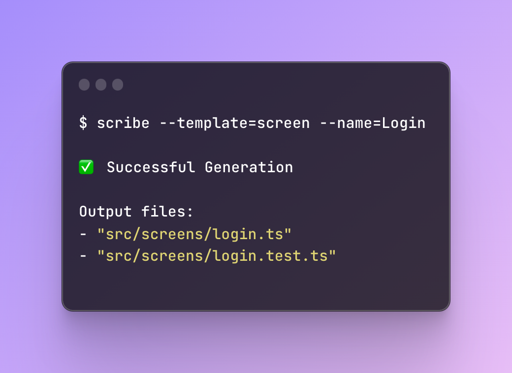

# scribe

Bootstrap your common files with [Mustache](https://github.com/mustache/mustache.github.com) templates.

<div align='center'>
  
</div>

<p align="center">


[//]: # (URL for usage example above)
[//]: # (https://ray.so/#code=JCBzY3JpYmUgLS10ZW1wbGF0ZT1zY3JlZW4gLS1uYW1lPUxvZ2luCgrinIUgU3VjY2Vzc2Z1bCBHZW5lcmF0aW9uCgpPdXRwdXQgZmlsZXM6IAotICJzcmMvc2NyZWVucy9sb2dpbi50cyIKLSAic3JjL3NjcmVlbnMvbG9naW4udGVzdC50cyIK&language=shell)

  

  <a href="https://www.npmjs.com/package/@kieran-osgood/scribe">
    
  </a>
</p>


[//]: # (Look into why this doesnt work)

[//]: # ([![npm version]&#40;https://badge.fury.io/js/@kieran-osgood/scribe.svg&#41;]&#40;//npmjs.com/package/kieran-osgood/scribe&#41;)

[//]: # (<a href="https://bundlephobia.com/package/@kieran-osgood/scribe@latest" target="\_parent">)

[//]: # ()

[//]: # (</a>)

---

## Quick Start
We can handle setup via built in commands to bootstrap out the initial config, you'll need to edit it to add in some of your domains file requirements before your first run (see below, or [examples](https://github.com/kieran-osgood/scribe/tree/main/examples))

### Install
```shell
npm i -D @kieran-osgood/scribe
pnpm i -D @kieran-osgood/scribe
yarn add -D @kieran-osgood/scribe
bun i -D @kieran-osgood/scribe
```

### Initialise Config file
```shell
scribe init
# or
cat 'node_modules/@kieran-osgood/scribe/base.ts' > scribe.config.ts
```

## Getting Started

A simple use-case is a creating a single file from a template, but each CLI run can be configured to output multiple files.

As an example, if you're creating a React Component, you can output test files, sub-component barrel files, storybook files
etc.

### Example

Given a config and scribe files **all in the root of the repository**:
```ts
// scribe.config.ts -- this is the config file we'll read the settings from
import type { ScribeConfig } from '@scribe/config';

const config = {
  options: {
    rootOutDir: '.',
    templatesDirectories: ['./examples'],
  },
  templates: {
    // Keys within the templates object correspond to what interactive mode will display, or --template flag will accept 
    screen: {
      outputs: [
        {
          // the templateFileKey screen corresponds to the template `screen.scribe` shown below 
          templateFileKey: 'screen',
          output: {
            directory: 'examples/src/screens',
            fileName: '{{Name}}.ts',
          },
        },
        {
          // the templateFileKey screen corresponds to the template `screen.test.scribe` shown below 
          templateFileKey: 'screen.test',
          output: {
            directory: 'examples/src/screens',
            fileName: '{{Name}}.test.ts',
          },
        },
      ],
    },
  },
} satisfies ScribeConfig;

export default config;

// ./screen.scribe -- This is the template file that we will generate from
import * as React from 'react';

type {{Name}}Props = {}

function {{Name}}Screen() {
  return (
    <></>
  )
}

// ./screen.test.scribe -- This is the template file that we will generate from
describe('{{Name}}', function() {
  it('should ', function() {

  });
});
```

When you run the following command

```sh
# Interactive mode!
scribe

# Non-Interactive mode
scribe --template screen --name Login

# Partially Interactive mode - will prompt for additional args!
scribe --template screen 
# or
scribe --name Login
```

> Note: you can either run in interactive mode, or pass the flags in directly, each of these commands allow you to get to the same end result

Given the above CLI run with the files and paths all setup appropriately, you should see the output of two files in the following directories

```tsx
// ✅ File Created: `examples/src/screens/Login.ts`
import * as React from 'react';

type LoginProps = {}

function LoginScreen() {
  return (
    <></>
  );
}

// ✅ File Created: `examples/src/screens/Login.test.ts`
describe('Login', function() {
  it('should ', function() {

  });
});
```